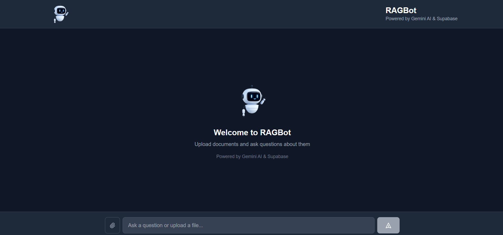

# RAG Chatbot - Gemini & Supabase

A modern **Retrieval-Augmented Generation (RAG)** chatbot built with Next.js 14, Vercel AI SDK, Google Gemini AI, and Supabase vector store.

## 🚀 Live Demo

[https://ragbot-op.vercel.app/](https://ragbot-op.vercel.app/)

---

## 📸 Screenshots & Demo

### Main Chat Interface


### Demo Video
[▶️ Watch Demo (MP4)](public/video.mp4)

---

## ✨ Features

- 🤖 **AI-Powered Chat** - Streaming responses using Google Gemini AI
- 📚 **RAG Implementation** - Retrieval-augmented generation for contextual answers
- 📄 **Document Upload** - Upload TXT/MD files to build your knowledge base
- 💾 **Vector Storage** - Supabase with pgvector for semantic search
- 🌓 **Dark Mode** - Beautiful light/dark theme toggle
- 💬 **Persistent Chat** - Chat history saved in localStorage
- 📱 **Responsive Design** - Works seamlessly on mobile and desktop
- ⚡ **Real-time Streaming** - See AI responses as they're generated

## 🏗️ Architecture

### Tech Stack

- **Framework**: Next.js 14 (App Router)
- **AI Model**: Google Gemini 1.5 Flash
- **Embeddings**: Gemini Embedding-001
- **Vector Store**: Supabase (PostgreSQL + pgvector)
- **AI SDK**: Vercel AI SDK
- **Styling**: TailwindCSS
- **Language**: TypeScript

### How RAG Works

1. **Document Ingestion**:
   - User uploads documents (TXT/MD files)
   - Documents are chunked into smaller pieces (500 chars with 50 char overlap)
   - Each chunk is embedded using Gemini embeddings
   - Chunks + embeddings stored in Supabase

2. **Query Processing**:
   - User asks a question
   - Question is embedded using the same model
   - Cosine similarity search finds top 3 relevant chunks
   - Retrieved chunks are added to the AI prompt as context

3. **Response Generation**:
   - Gemini receives the query + retrieved context
   - Generates a streaming response
   - Citations show which documents were used

## 📋 Prerequisites

- Node.js 18+ and npm
- Supabase account ([create one](https://supabase.com))
- Google AI API key ([get one](https://makersuite.google.com/app/apikey))

## 🛠️ Installation

### 1. Clone the Repository

```bash
git clone https://github.com/shashix07/rag-chatbot
cd rag-chatbot
```

### 2. Install Dependencies

```bash
npm install
```

### 3. Setup Supabase Database

1. Create a new project on [Supabase](https://supabase.com)
2. Go to **SQL Editor** and run this script:

```sql
-- RAG Chatbot - Supabase Database Setup
-- Run this script in your Supabase SQL Editor

-- Enable pgvector extension for vector operations
CREATE EXTENSION IF NOT EXISTS vector;

-- Create documents table to store text chunks with embeddings
CREATE TABLE IF NOT EXISTS documents (
  id UUID PRIMARY KEY DEFAULT gen_random_uuid(),
  content TEXT NOT NULL,
  embedding vector(768),  -- Gemini embeddings are 768 dimensions
  metadata JSONB,
  created_at TIMESTAMP WITH TIME ZONE DEFAULT NOW()
);

-- Create index for faster similarity search using IVFFlat algorithm
CREATE INDEX IF NOT EXISTS documents_embedding_idx 
ON documents 
USING ivfflat (embedding vector_cosine_ops)
WITH (lists = 100);

-- Enable Row Level Security
ALTER TABLE documents ENABLE ROW LEVEL SECURITY;

-- Create policy to allow all operations
CREATE POLICY "Allow all operations on documents" 
ON documents
FOR ALL
USING (true)
WITH CHECK (true);

-- Optional: Create a function to search for similar documents
CREATE OR REPLACE FUNCTION match_documents(
  query_embedding vector(768),
  match_threshold float DEFAULT 0.5,
  match_count int DEFAULT 3
)
RETURNS TABLE (
  id UUID,
  content TEXT,
  metadata JSONB,
  similarity float
)
LANGUAGE sql STABLE
AS $$
  SELECT
    documents.id,
    documents.content,
    documents.metadata,
    1 - (documents.embedding <=> query_embedding) AS similarity
  FROM documents
  WHERE 1 - (documents.embedding <=> query_embedding) > match_threshold
  ORDER BY documents.embedding <=> query_embedding
  LIMIT match_count;
$$;

-- Function to clean up old documents
CREATE OR REPLACE FUNCTION cleanup_old_documents()
RETURNS void
LANGUAGE plpgsql
AS $$
BEGIN
  DELETE FROM documents
  WHERE created_at < NOW() - INTERVAL '30 minutes';
END;
$$;

CREATE OR REPLACE FUNCTION trigger_cleanup()
RETURNS TABLE (deleted_count bigint)
LANGUAGE plpgsql
AS $$
DECLARE
  count_deleted bigint;
BEGIN
  DELETE FROM documents
  WHERE created_at < NOW() - INTERVAL '30 minutes';
  
  GET DIAGNOSTICS count_deleted = ROW_COUNT;
  RETURN QUERY SELECT count_deleted;
END;
$$;

-- Verify setup
SELECT 'Database setup complete!' AS status;
```

3. Get your credentials from **Settings > API**:
   - Project URL
   - Anon/Public key
   - Service role key (keep secret!)

### 4. Configure Environment Variables

Copy `.env.example` to `.env.local`:

```bash
cp .env.example .env.local
```

Edit `.env.local` with your credentials:

```env
# Gemini API Key (Get from: https://makersuite.google.com/app/apikey)
GOOGLE_API_KEY=your_gemini_api_key_here

# Supabase Configuration (Get from: https://supabase.com/dashboard)
NEXT_PUBLIC_SUPABASE_URL=https://your-project.supabase.co
NEXT_PUBLIC_SUPABASE_ANON_KEY=your_supabase_anon_key
SUPABASE_SERVICE_ROLE_KEY=your_supabase_service_role_key
```

### 5. Run the Development Server

```bash
npm run dev
```

Open [http://localhost:3000](http://localhost:3000) in your browser.

## 📖 Usage

### 1. Upload Documents

- Click the upload area at the bottom
- Select a `.txt` or `.md` file
- Wait for processing (chunks will be created and embedded)

### 2. Ask Questions

- Type your question in the chat input
- The bot will:
  - Search for relevant document chunks
  - Generate a contextual answer
  - Show source references

### 3. Manage Chat

- **Clear Chat**: Click "Clear chat" to reset conversation
- **Dark Mode**: Toggle theme with the icon in header

## 🗂️ Project Structure

```
rag-chatbot/
├── app/
│   ├── api/
│   │   ├── chat/route.ts          # RAG chat endpoint
│   │   └── upload/route.ts        # Document upload endpoint
│   ├── layout.tsx                 # Root layout
│   ├── page.tsx                   # Home page
│   └── globals.css                # Global styles
├── components/
│   ├── ChatInterface.tsx          # Main chat UI
│   ├── ChatMessage.tsx            # Message bubble component
│   ├── FileUpload.tsx             # File upload component
│   └── ThemeToggle.tsx            # Dark mode toggle
├── lib/
│   ├── gemini.ts                  # Gemini client & embeddings
│   ├── supabase.ts                # Supabase client (client-side)
│   ├── supabaseAdmin.ts           # Supabase admin (server-side)
│   └── vectorStore.ts             # Vector store operations
├── types/
│   └── index.ts                   # TypeScript types
├── .env.local                     # Environment variables (gitignored)
├── .env.example                   # Example env file
└── README.md                      # This file
```

## 🔧 Customization

### Change Chunk Size

Edit `lib/vectorStore.ts`:

```typescript
export function chunkText(text: string, chunkSize: number = 500, overlap: number = 50)
```

### Change Number of Retrieved Documents

Edit `app/api/chat/route.ts`:

```typescript
const relevantDocs = await retrieveRelevantDocuments(userQuery, 3); // Change 3 to desired number
```

### Switch AI Model

Edit `lib/gemini.ts`:

```typescript
return genAI.getGenerativeModel({ model: 'gemini-1.5-pro' }); // Use Pro instead of Flash
```
